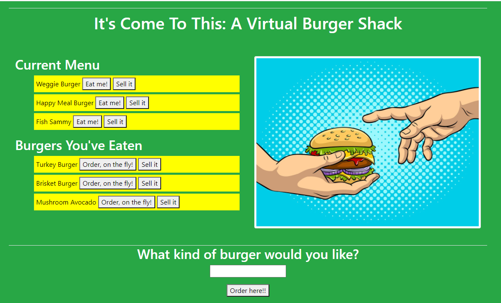

# It's Come To This: A Virtual Burger Shack

  
## Description 
Quarantine keeping you from eating what you really want? This virtual burger application combines the use MySQL, Node, Express, Handlebars, as well as its very own homemade ORM (yum!) Don't bother with those pesky germs, Use this app to create and DEVOUR your very own virtual burger. Bon appetit!

## Table of Contents 
* [Installation](#Installation)
* [Usage](#Usage)
* [License](#License)
* [Contributing](#Contributing)
* [Tests](#Tests)
* [Visuals](#Visuals)
* [Links](#Links)
* [Questions](#Questions)

## Installation
1. Use 'git clone https://github.com/kbnewlon/burger' to clone the repo
2. Install necessary dependencies with 'npm install'
3. Start the program with 'npm start' or 'node server.js'

## Usage
1. Type in a burger that you'd like to eat and click submit 
2. Click 'Eat Me!' to devour the burger
3. Click 'Order on the Fly!' to order more
4. 'Sell it' will sell the order off your screen
6. Don't worry about the pesky calories!
7. Enjoy!

## License
Copyright (c) 2020, Kayla Newlon. (MIT License)

## Contributing 
No guidelines at this time 

## Tests
No tests available 

## Visuals

## Links
To Repo: https://github.com/kbnewlon/burger
 Visit the deployed app on Heroku to demo: https://a-virtual-burger-shack.herokuapp.com/
 

## Questions 
Please contact me if you have any questions at:
 Email: kbnewlon@hotmail.com
 Github: https://github.com/kbnewlon

